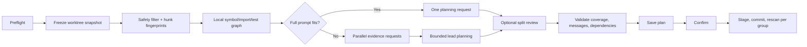

# atc — Atomic Commits CLI

`atc` turns the safe changes in a dirty Git worktree into a reviewed sequence of
meaningful, atomic commits. It freezes the current change set, builds a local
change graph, asks an AI provider for a plan, validates exact hunk coverage, and
then stages and commits one group at a time.

It commits locally only. It does not push, rewrite history unless explicitly
asked, edit source files, or format code.

## Requirements

- Python 3.11 or newer
- Git available on `PATH`
- A repository with at least one commit
- An OpenAI-compatible or Anthropic API key

## Install

From a checkout with `pipx`:

```bash
pipx install .
atc --version
```

From a checkout:

```bash
python -m venv .venv
. .venv/bin/activate
python -m pip install -e .
atc --version
```

## Configure a provider

The fastest setup is the interactive wizard:

```bash
atc init
```

`atc` supports `openai-compatible` and `anthropic`. Values are resolved in
this order:

1. CLI options
2. Environment variables
3. The first config file found: `./.atc.toml`, then
   `~/.config/atc/config.toml`
4. Built-in defaults

A repo-local config therefore replaces, rather than merges with, the global
config for that run.

### Environment variables

```bash
# OpenAI-compatible
export ATC_OPENAI_API_KEY=sk-...
export ATC_OPENAI_MODEL=gpt-4o-mini
export ATC_OPENAI_BASE_URL=https://api.openai.com/v1

# Anthropic
export ATC_ANTHROPIC_API_KEY=sk-ant-...
export ATC_ANTHROPIC_MODEL=claude-3-5-sonnet-latest
export ATC_ANTHROPIC_BASE_URL=https://api.anthropic.com

# Optional split-review default
export ATC_REVIEW=true
```

Planner limits and retry controls are exposed as global CLI options. The
configuration resolver can also read `ATC_PROVIDER_TIMEOUT`,
`ATC_RETRY_ATTEMPTS`, `ATC_FULL_CHANGE_LIMIT`, and `ATC_TIME_LIMIT` when its
caller leaves those values unset; the CLI currently supplies the defaults
shown by `atc --help`.

### Config file

Provider table names may use a hyphen or underscore. For example,
`[openai-compatible]` and `[openai_compatible]` are equivalent.

```toml
[openai-compatible]
model = "gpt-4o-mini"
base_url = "https://api.openai.com/v1"
api_key_env = "ATC_OPENAI_API_KEY"
message_template = "${scope}: ${verb} ${object}"
```

An `api_key` may be stored inline, but `api_key_env` is safer. Config files
created by `atc init` are owner-readable only.

## Quick start

```bash
atc                 # plan, show the plan, confirm, and commit
atc --yes           # plan and commit without confirmation
atc plan            # save and display a plan without committing
atc apply            # apply the latest saved plan
atc commit           # include staged changes and run pre-commit once
atc commit --yes     # same, without confirmation
```

Bare `atc` rejects an already-staged index unless `--include-staged` is set.
`atc commit` always includes staged and unstaged changes and defaults to
`--hooks once`.

With `--json`, global options must come before the subcommand. Bare
`atc --json` prints the plan and does not commit unless `--yes` is also passed.

## Commands

| Command | Purpose |
|---|---|
| `atc` | Plan, confirm, and apply the current safe changes. |
| `atc plan` | Build and save a dry-run plan. |
| `atc apply [PLAN_PATH]` | Apply the latest or a specified saved plan. |
| `atc commit` | Include staged changes and handle hooks before planning. |
| `atc doctor` | Locally check Git, current CLI provider/model/base URL values, and API-key environment presence. |
| `atc sessions` | List session IDs, status, and commit counts. |
| `atc show-plan [PATH]` | Render a saved plan; add `--show-diff` or `--json`. |
| `atc explain GROUP_ID [PATH]` | Show one group's rationale and hunk diffs. |
| `atc resume` | Continue the latest incomplete session. |
| `atc undo SESSION_ID` | Reverse that session's `backup.patch`. |
| `atc selftest` | Exercise the deterministic local harness. |
| `atc init` | Write provider config interactively and run diagnostics. |

Run `atc --help` or `atc COMMAND --help` for the complete option list.

`doctor` is hermetic: it does not read config files, resolve provider defaults,
or call a provider. `atc init` runs it immediately with the values entered in
the wizard. For a later explicit check, pass the same global provider/model
options before `doctor`.

## Common workflows

### Limit the scope

`--paths` is repeatable and accepts files or directories relative to the
repository root:

```bash
atc --paths src/atomic_commits --paths tests plan
```

### Inspect before applying

```bash
atc plan
atc show-plan --show-diff
atc explain group-id
atc apply
```

`atc apply` rescans the worktree and refuses the saved plan if its fingerprint
no longer matches.

### Hook policy

```bash
atc commit --hooks once   # default: run standard pre-commit once
atc commit --hooks each   # let Git run hooks for every commit
atc commit --hooks skip   # skip hooks
```

With `once`, `atc` recognizes a standard `pre-commit` generated hook and runs
it against the changed safe files before planning. If a hook modifies files,
it retries up to three times. Custom pre-commit hooks and active `commit-msg`
hooks run through Git for every commit. `--no-verify` skips all hooks.

### Rewrite the last commit

```bash
atc --amend          # re-plan HEAD's diff into atomic commits
atc --squash         # re-plan HEAD's diff, then recreate one commit
atc --amend --yes    # non-interactive rewrite
```

Both modes reset `HEAD~1` with a mixed reset and recreate the last commit's
changes. They require a commit with a parent and always confirm unless `--yes`
is supplied.

### Add trailers or message templates

```bash
atc --trailer "Co-authored-by: A User <a@example.com>"
atc --message-template '${scope}: ${verb} ${object}'
```

`--trailer` is repeatable. Templates support `${scope}`, `${verb}`, and
`${object}` and can also be set per provider in the config file.

### Resume or recover

```bash
atc sessions
atc resume
atc undo 20260726-120000-abcdef
```

Before applying a plan, `atc` stores a binary-safe worktree patch. `resume`
checks that every remaining planned hunk still exists before continuing.
`undo` runs `git apply --reverse` on the selected session backup; it does not
reset commits that were already created.

## What planning does



Planning results are content-addressed by the worktree fingerprint and relevant
planner settings. Unchanged retries can reuse completed evidence and plans.

On an interactive terminal, OpenAI-compatible providers show a rolling preview
of the latest streamed model response in the live elapsed-time display. Each new
fragment replaces the previous one, so long planning calls remain visibly active
without filling terminal history. Retry and automatic recovery status appears in
the same display. Anthropic shows lifecycle progress without a response preview;
`--json` suppresses all interactive progress.

## Safety model

By default, `atc` excludes common secret, environment, VCS, dependency, cache,
build, database, and log paths. Sample env files such as `.env.example` are
allowed. Binary changes are rejected unless `--allow-binary` is set, and even
then only known asset extensions are accepted.

A repo-root `.atcallow` can override path denylisting with one glob per line:

```gitignore
# Deliberate exceptions
fixtures/example.key
generated/reference/**
```

Treat `.atcallow` as security-sensitive: it can permit paths that are denied by
default. Git-ignored, untracked files are not discovered by the scanner.

The apply path has four important guards:

1. A saved plan must match the current worktree fingerprint.
2. Every safe hunk must appear exactly once in the plan.
3. Staging rematches planned content fingerprints and rejects extra paths.
4. A failure unstages touched paths and stops; there is no broad fallback commit.

## Repository instructions

Unless `--no-instructions` is used, the planner sends at most 4,000 characters
total from these repo-root files to the configured provider:

1. `AGENTS.md`
2. `.cursorrules`
3. `CLAUDE.md`
4. `README.md`

They are context only and are never executed.

## Session data

Runtime state lives inside the target repository's Git directory:

```text
.git/atc/
├── lock
├── plan.json
└── sessions/
    ├── cache/
    │   ├── chunk-*.json
    │   └── plans/
    └── <timestamp>-<random>/
        ├── snapshot.json
        ├── plan.json
        ├── backup.patch
        └── apply_log.json
```

Session writes are locked and JSON files are replaced atomically. Session and
backup files are owner-readable only.

## JSON output

Use `--json` before the subcommand:

```bash
atc --json plan
atc --json sessions
atc --json show-plan
atc --json explain group-id
```

JSON mode suppresses interactive progress. Errors are emitted as JSON with a
non-zero exit code. `atc init` is interactive and does not support JSON mode;
destructive confirmation paths such as `undo` and history rewrites require
`--yes` when JSON or a non-interactive terminal is used.

## Further reading

- [Architecture and lifecycles](docs/architecture.md)
- [Development and verification](docs/development.md)
- [Changelog](CHANGELOG.md)
