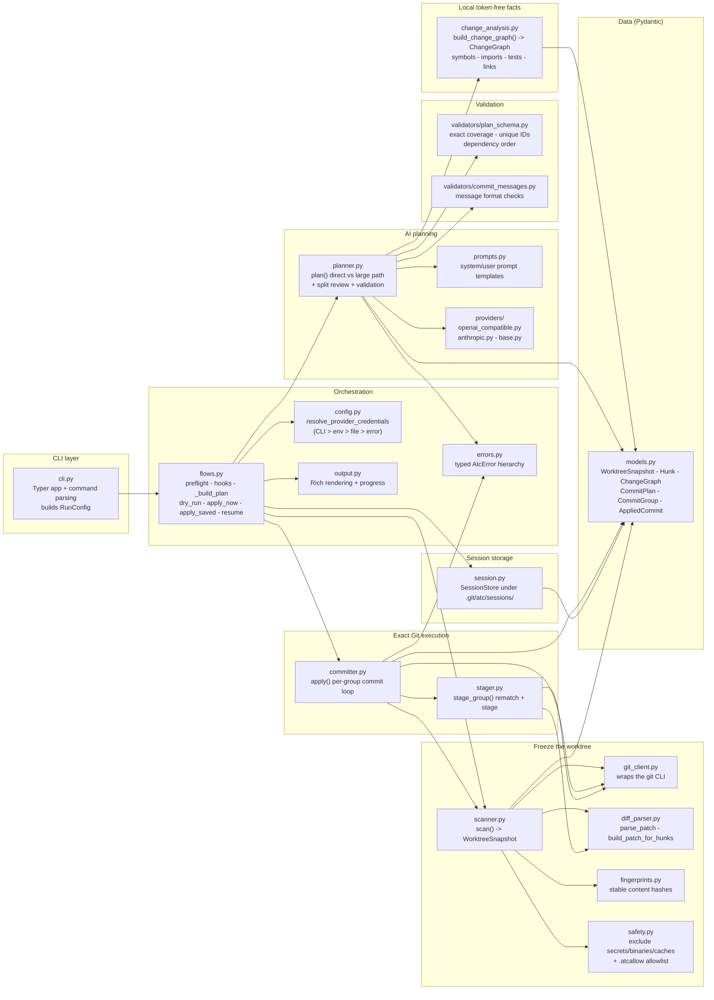
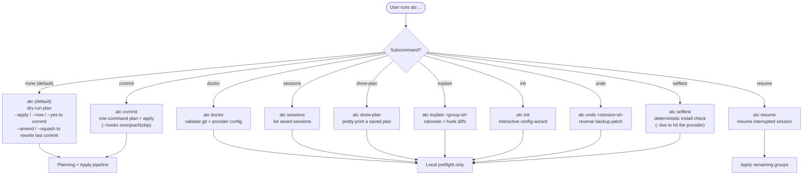
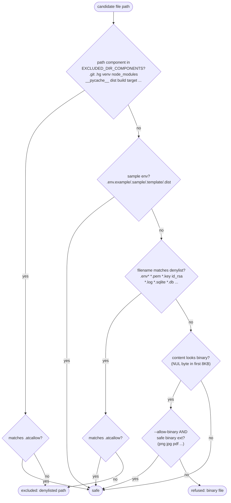
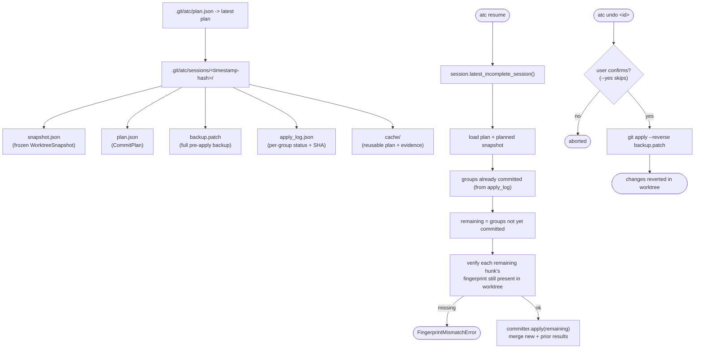
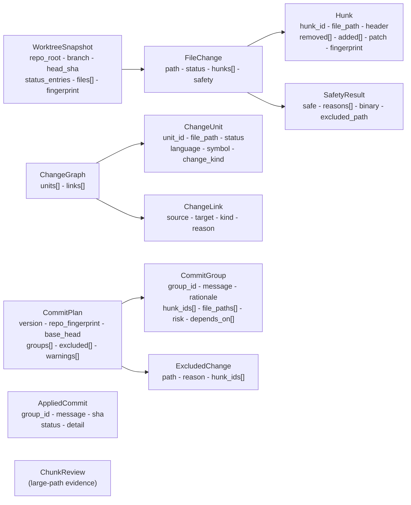

# ATC — How the Project Works (Architecture & Flow)

This document explains how `atc` (**A**tomic **C**ommits CLI) works end to end,
backed by Mermaid diagrams. Every node below maps to a real module, function,
or data model in `src/atomic_commits/`.

> `atc` turns **one dirty Git worktree** into the **greatest useful number of
> meaningful, atomic commits**. It does local, token-free analysis first
> (symbols, tests, imports, links), then asks a strong AI model to make the
> final commit plan. It stages exact hunks, commits each group in dependency
> order, and rescans the worktree after every commit. Safety first: it never
> commits `.env`, ignored/generated/secret files, or (by default) binaries.

## Tech stack

| Concern        | Choice                                              |
|----------------|-----------------------------------------------------|
| Language       | Python >= 3.11                                      |
| CLI framework  | [Typer](https://typer.tiangolo.com/)                |
| Terminal UI    | [Rich](https://rich.readthedocs.io/)                |
| Data models    | [Pydantic](https://docs.pydantic.dev/) v2           |
| Provider HTTP  | stdlib `urllib` (no SDK dependency)                |
| Build backend  | Hatchling                                           |
| Entry point    | `atc = "atomic_commits.cli:app"` (in `pyproject.toml`) |

---

## 1. Module map (component layers)

The codebase is organized into clear layers. The CLI stays thin; `flows.py`
orchestrates everything; the heavy logic lives in the planning, scanning, and
apply modules.



---

## 2. Command surface

`atc` exposes one default command (no subcommand) plus several explicit
subcommands. The default command and `atc commit` are the main entry points.



---

## 3. Main flow: `atc commit` (end to end)

This is the heart of the tool — `atc commit` (or the default command with
`--apply --now`). It plans, shows the plan, asks for confirmation, stages exact
changed regions, and creates the commits.

```mermaid
flowchart TD
    Run([atc commit --yes]) --> Args["cli.py: parse flags -> RunConfig<br/>(mode, provider, model, paths, limits)"]
    Args --> Hooks["flows.prepare_hooks()<br/>run pre-commit ONCE if installed<br/>(--hooks once|each|skip)"]
    Hooks --> Preflight["flows.preflight()<br/>git repo? no in-progress ops?<br/>has commits? staged policy?"]
    Preflight -->|fail| ErrAtc([AtcError -> red message / JSON error])
    Preflight -->|ok| BuildPlan["flows.dry_run() -> _build_plan()"]

    subgraph BP["_build_plan()"]
        direction TB
        Resolve["config.resolve_provider_credentials()<br/>CLI > env > config file > error"]
        Scan["scanner.scan() -> WorktreeSnapshot<br/>freeze HEAD/branch/status<br/>parse diffs - safety filter - fingerprint"]
        WriteSnap["session.write_snapshot()"]
        BuildProv["providers.build_provider()<br/>openai-compatible OR anthropic"]
        Plan["planner.plan() -> CommitPlan<br/>(see diagram 4)"]
        WritePlan["session.write_plan()<br/>.git/atc/sessions/&lt;id&gt;/plan.json"]
        PrintPlan["output.print_plan()"]
        Resolve --> Scan --> WriteSnap --> BuildProv --> Plan --> WritePlan --> PrintPlan
    end

    BuildPlan --> BP
    PrintPlan --> Confirm{User confirms?<br/>(skipped by --yes)}
    Confirm -->|no| Abort([aborted])
    Confirm -->|yes| Apply["flows.apply_saved()"]

    subgraph AP["apply_saved() / committer.apply() (see diagram 5)"]
        direction TB
        ReScan["rescan worktree<br/>fingerprint must match plan"]
        Backup["git.backup_patch() -> write backup.patch"]
        Loop["for each CommitGroup in dependency order:<br/>stage_group -> verify only -> commit -> rescan"]
        Log["session.write_apply_log()"]
        ReScan --> Backup --> Loop --> Log
    end

    Apply --> AP
    Log --> Done([commits created - worktree clean])
```

---

## 4. The planning pipeline (direct vs large path)

`planner.plan()` is the adaptive semantic planner. It picks one of two paths
based on whether the *entire* change fits under `--full-change-limit`
(default **120,000** estimated tokens). Both paths converge on the same review
and validation steps. Completed work is cached under
`.git/atc/sessions/cache/` keyed by snapshot + model + prompt version, so an
unchanged retry resumes.

```mermaid
flowchart TD
    PStart([planner.plan]) --> Ctx["build_context_pack()<br/>repo name - branch - recent subjects<br/>diffstat - file list - hunk inventory<br/>instruction files: AGENTS.md/.cursorrules/CLAUDE.md/README.md<br/>(<= 4000 chars total, untrusted)"]
    Ctx --> Graph["change_analysis.build_change_graph()<br/>ChangeGraph: ChangeUnits + ChangeLinks<br/>(same_file - same_symbol - test - import)"]
    Graph --> Diff["_full_diff(snapshot)"]
    Diff --> Estimate["estimate tokens for direct request<br/>(~4 chars/token heuristic)"]

    Estimate --> CacheCheck{cached plan<br/>for this snapshot?}
    CacheCheck -->|yes| ReusePlan["reuse cached CommitPlan"]
    CacheCheck -->|no| SizeCheck{direct tokens<br/><= --full-change-limit?}

    SizeCheck -->|yes| Direct["DIRECT PATH<br/>one full-change request<br/>(prompts.DIRECT_SYSTEM + direct_user)"]
    SizeCheck -->|no| Large["LARGE PATH"]

    subgraph L["Large path (map/reduce)"]
        direction TB
        Chunk["chunk_hunks()<br/>pack related regions up to<br/>--max-chunk-tokens (<= 4000)"]
        Map["run_map(): parallel evidence requests<br/>(bounded, faster) -> list[ChunkReview]"]
        Reduce["run_reduce(): ONE lead planner<br/>sees ALL evidence -> CommitPlan"]
        Chunk --> Map --> Reduce
    end

    Direct --> StoreCache["_store_plan_cache(initial)"]
    Reduce --> StoreCache
    ReusePlan --> Review

    StoreCache --> Review{--review enabled?<br/>(default: yes)}
    Review -->|yes| ReviewReq["split-review request<br/>(prompts.REVIEW_SYSTEM)<br/>tries to find more useful splits"]
    ReviewReq --> ReviewValid{reviewed plan<br/>valid?}
    ReviewValid -->|yes| KeepReview["use reviewed plan"]
    ReviewValid -->|no, but lead valid| KeepLead["keep the valid lead plan"]
    ReviewValid -->|lead was invalid| Repair["repair request<br/>then local _repair_plan_locally()"]
    Repair --> KeepReview
    Review -->|no| SkipReview["skip review"]

    KeepReview --> Tmpl
    KeepLead --> Tmpl
    SkipReview --> Tmpl
    Tmpl["_apply_template_to_plan()<br/>fill ${scope} ${verb} ${object} if --message-template"]
    Tmpl --> Validate["_validate()<br/>validators/plan_schema + commit_messages<br/>exact coverage - unique IDs - valid msgs - order"]
    Validate -->|invalid & unrepairable| PlanErr([PlanValidationError])
    Validate -->|valid| Final([CommitPlan<br/>N meaningful atomic commits])
```

---

## 5. The apply / commit loop

`committer.apply()` runs once per group, in dependency order. Crucially, it
**rescans the worktree after every commit** and stops on the first unsafe
mismatch — it never creates a broad fallback commit.

```mermaid
flowchart TD
    AStart([committer.apply]) --> FirstScan["scan() worktree<br/>(plus restore+rescan if --include-staged)"]
    FirstScan --> Head["record head_before"]
    Head --> GroupLoop{"for each group<br/>idx/total"}

    GroupLoop --> Stage["stager.stage_group(group, snapshot)<br/>rematch fingerprints + removed/added lines<br/>whole-file add/delete/rename/mode<br/>else patch-stage via git apply --cached"]
    Stage --> StageOK{staged hunks?}
    StageOK -->|none| StageFail["PatchApplyError"]
    StageOK -->|ok| Verify["stager._verify_only()<br/>only planned paths may be staged"]
    Verify --> Commit["git.commit(message, no_verify?)"]
    Commit --> HeadChk{"HEAD advanced?"}
    HeadChk -->|no| HeadFail["record: did not advance HEAD"]
    HeadChk -->|yes| Rescan["scan() worktree again<br/>(line numbers changed)"]
    Rescan --> Next{"more groups?"}
    Next -->|yes| GroupLoop
    Next -->|no| Result([return list[AppliedCommit]<br/>all committed])

    StageFail --> Cleanup["git.restore_staged(touched paths)<br/>NEVER leave staged changes behind"]
    HeadFail --> Cleanup
    Verify -- "unplanned paths" --> Cleanup
    Cleanup --> Partial([return results - stop on first failure])
```

---

## 6. Config resolution priority

Provider settings are resolved in a strict order. The first source that
provides a value wins; a missing required value raises a `ProviderError` with a
setup hint.

```mermaid
flowchart TD
    Cfg([RunConfig from CLI]) --> L1{"1. CLI flags set?<br/>(--model --base-url --api-key-env --provider)"}
    L1 -->|yes| Use1["use CLI value"]
    L1 -->|no| L2{"2. Environment variables?<br/>ATC_OPENAI_* / ATC_ANTHROPIC_*"}
    L2 -->|yes| Use2["use env value"]
    L2 -->|no| L3{"3. Config file?<br/>.atc.toml OR ~/.config/atc/config.toml<br/>(one table per provider)"}
    L3 -->|yes| Use3["use file value"]
    L3 -->|no| L4{"4. Built-in defaults"}
    L4 -->|value exists| Use4["use default (base URL, etc.)"]
    L4 -->|required missing| ProvErr([ProviderError<br/>+ setup hint])
    Use1 --> Build["providers.build_provider()"]
    Use2 --> Build
    Use3 --> Build
    Use4 --> Build
    Build --> Out([AIProvider<br/>OpenAI-compatible | Anthropic])
```

---

## 7. Safety model (what never gets committed)

`safety.py` runs **before** the AI sees any content and **before** staging. A
`.atcallow` file in the repo root can override denylist matches with globs.



---

## 8. Session, resume, and recovery

Every run creates a session under `.git/atc/sessions/<id>/` containing the
snapshot, plan, backup patch, and apply log. This is what makes `atc resume`
and `atc undo` possible. A `backup.patch` is written **before** any commit, so
a failed or interrupted run can be reversed.



---

## 9. Key data models

These Pydantic models (in `models.py`) flow through the pipeline. They are the
contract between modules.



---

## 10. Summary of guarantees

- **Safety first** — never commits `.env`, ignored/generated/secret files, or
  binaries by default; `.atcallow` can override.
- **Every safe region assigned exactly once** — local validation enforces
  exact coverage, unique group IDs, valid messages, and dependency order.
- **No AI while editing** — all planning happens on a frozen snapshot; no AI
  request runs while files are being staged/committed.
- **Provider failure never falls back** — no low-quality catch-all commits; an
  invalid plan is repaired or rejected.
- **Rescan after every commit** — the committer stops on the first mismatch and
  unstages anything it touched.
- **Resumable** — plans, evidence, and backups are cached; `atc resume` and
  `atc undo` recover from interruption.

## Further reading

- `docs/implementation.md` — full product spec and design (sections 6-24).
- `docs/operation.md` — build progress log.
- `README.md` — end-user usage and config reference.
- `CHANGELOG.md` — notable behavior changes.
