# Architecture and code lifecycles

This document describes the current `0.2.5` implementation. Names in diagrams
map directly to modules, classes, or functions under `src/atomic_commits/`.

## System boundaries

`atc` is a synchronous Python CLI. Git is invoked as a subprocess. OpenAI-compatible
requests stream through the official OpenAI client; Anthropic uses the shared `urllib`
helper. Pydantic models are the contracts between scanning, planning, persistence,
and applying.

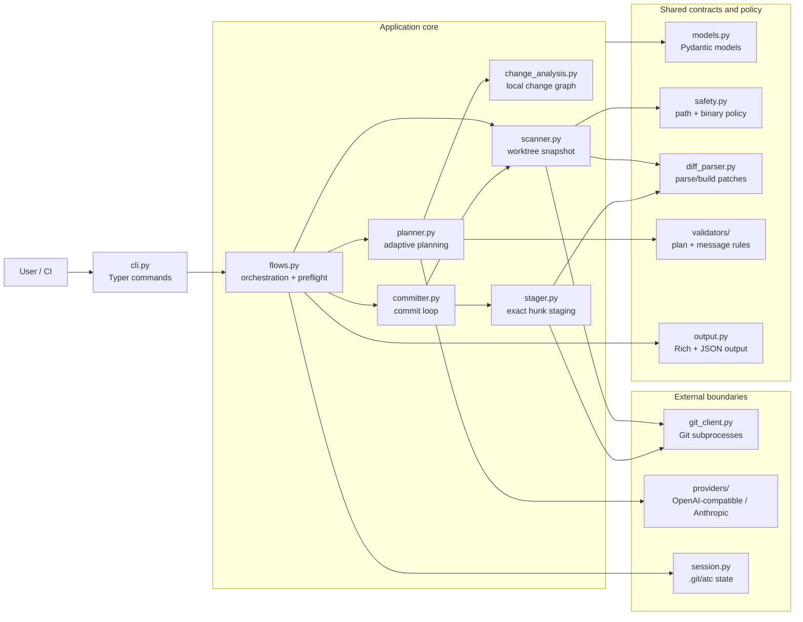

### Module responsibilities

| Module | Owns | Does not own |
|---|---|---|
| `cli.py` | Option parsing, command dispatch, confirmation, JSON error envelope | Git mechanics or planning logic |
| `config.py` | `RunConfig`, config/env resolution, config creation | CLI prompts and hermetic doctor checks |
| `flows.py` | Preflight, hook preparation, plan/apply/resume orchestration | Hunk parsing or model prompts |
| `git_client.py` | Typed wrapper around Git commands | Policy decisions |
| `scanner.py` | Frozen `WorktreeSnapshot`, staged/untracked handling, path scope | Commit grouping |
| `safety.py` | Denylist, `.atcallow`, safe binary policy | Git ignore rules |
| `diff_parser.py` | Unified-diff parsing and selected-hunk patch reconstruction | Staging |
| `change_analysis.py` | Deterministic local facts and links | Final grouping decisions |
| `planner.py` | Direct/large planning, caches, review, repair, validation | Applying commits |
| `providers/` | HTTP request/response translation, retries, JSON extraction, usage | Planning policy |
| `stager.py` | Fingerprint rematch, exact index updates, extra-path check | Commit loop |
| `committer.py` | Stage/commit/rescan loop and failure cleanup | Session selection |
| `session.py` | Locked, persistent snapshots, plans, logs, backups, cache paths | Worktree mutation |
| `output.py` | Human and machine-readable rendering | Application decisions |

## Command dispatch lifecycle

Typer invokes the root callback first. It builds one `RunConfig`, stores it on
the context, and either dispatches the default flow or leaves it for a
subcommand.

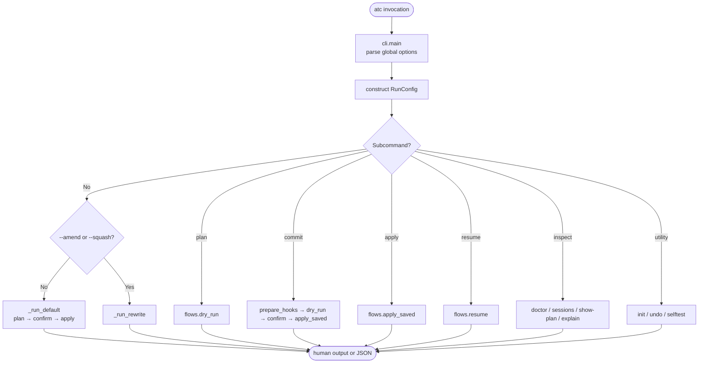

The default command and `plan` reject staged changes unless
`--include-staged` is set. `commit` sets `include_staged=True` itself.

## Plan-and-apply lifecycle

Bare `atc` uses `flows.dry_run()` to create a persisted plan and then
`flows.apply_saved()` to apply the latest plan. The split keeps `atc plan` and
`atc apply` reusable while preserving the same validation path.

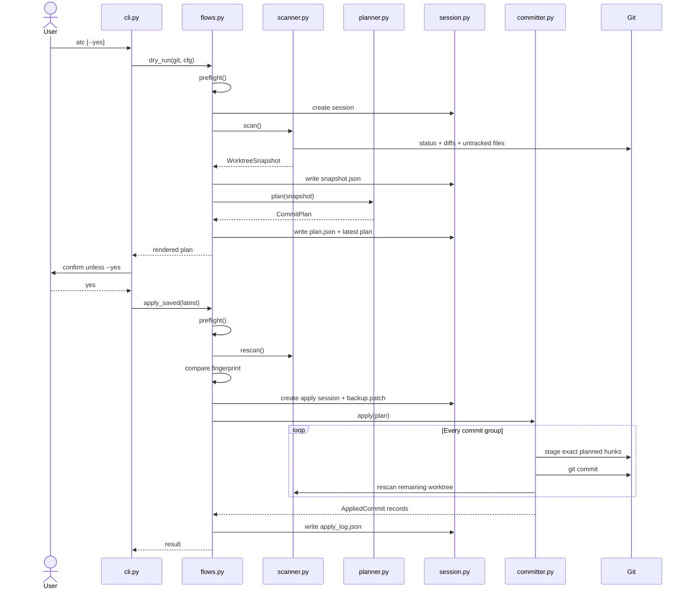

`apply_saved()` creates a new session even when the plan came from an earlier
planning session. This gives the apply attempt its own snapshot, backup, and
log while keeping `.git/atc/plan.json` as the latest-plan pointer.

## Preflight

`flows.preflight()` is shared by planning and applying:

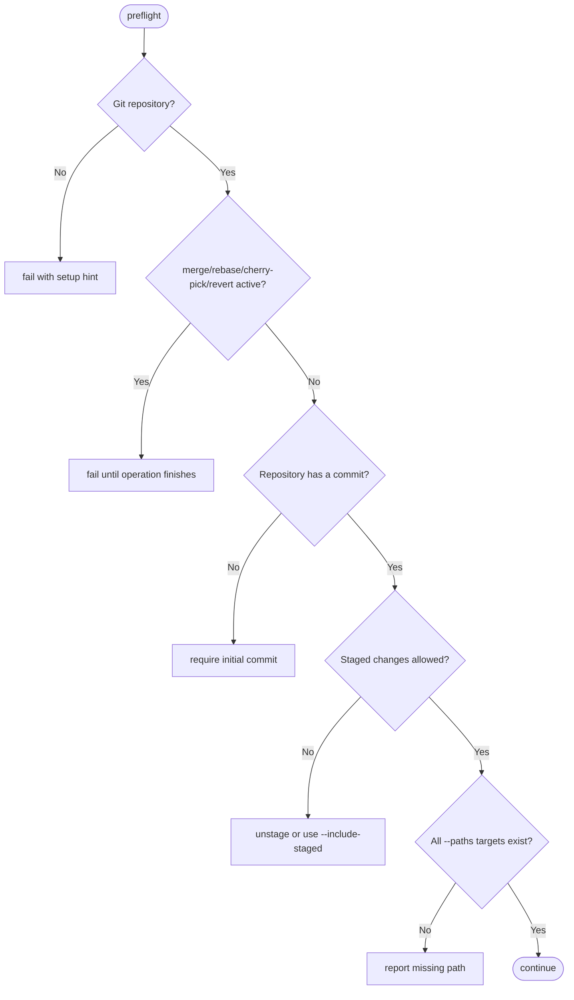

## Scan lifecycle

`scanner.scan()` converts mutable Git state into a `WorktreeSnapshot` with a
stable fingerprint.

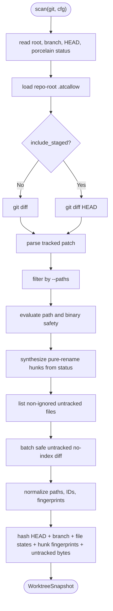

Tracked changes use `git diff` or `git diff HEAD`. Untracked files are absent
from ordinary Git diffs, so the scanner synthesizes added-file patches in one
batched no-index operation. Pure renames receive a file-level synthetic hunk so
they cannot disappear from planning.

### Change identity

Each `Hunk` has both a human-readable ID (`path::hunk::N`) and a content
fingerprint derived from its path, added/removed lines, header, and leading
context. IDs make plans readable; fingerprints allow the stager to find the
same change after earlier commits shift line numbers.

## Local change graph

`change_analysis.build_change_graph()` runs without a provider call. Each safe
hunk becomes a `ChangeUnit` with path, status, language, change kind, nearby
lines, and—where available—a Python symbol.

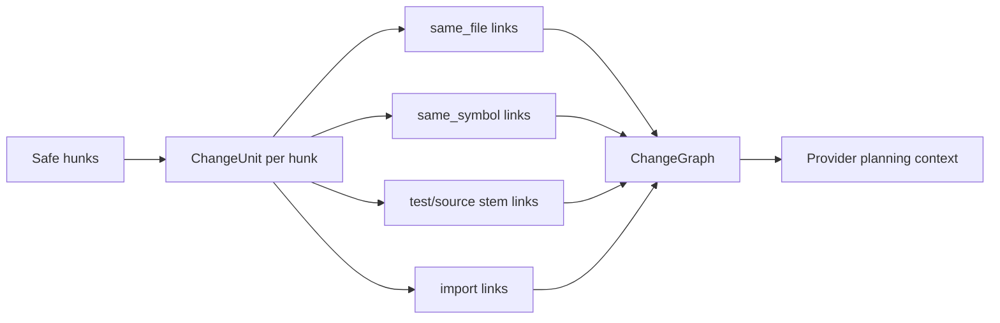

Links are deliberately sparse: adjacent units bridge a file or symbol, and one
bridge represents each test/source or importing/imported relationship. This
avoids quadratic prompt growth.

## Adaptive planning lifecycle

The planner estimates input size with a four-characters-per-token heuristic.
It chooses a direct path when the complete prompt fits `full_change_limit` and
an evidence-assisted path otherwise.

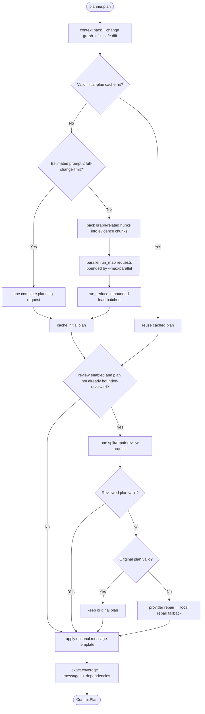

### Context pack

`build_context_pack()` contains repository name, branch, base HEAD, recent
commit subjects, diffstat, file/hunk inventory, and up to 4,000 characters from
supported instruction files unless disabled.

### Large-change path

Evidence chunks preserve complete hunks and prefer locally connected changes.
`run_map()` caches each structured `ChunkReview` and preserves deterministic
result order despite parallel execution. Lead planning partitions oversized
inputs into bounded batches; failed or incomplete batches are split and
retried. This may produce a bounded-plan warning, in which case the batch lead
work includes the final review instead of issuing another global review.

### Plan validation

The final plan is accepted only when:

- group IDs are unique;
- every safe hunk is assigned exactly once;
- no group is empty or references an unknown hunk;
- declared file paths exactly match the group's hunks;
- dependencies reference known, earlier groups;
- excluded entries have reasons; and
- every commit message passes the message validator.

Verbose multi-hunk groups must also include a rationale.

## Provider lifecycle

Both providers implement `AIProvider.complete_json()` and return the same validated
JSON shape. The OpenAI-compatible adapter streams partial output into Rich's live
progress display; Anthropic remains a bounded request/response adapter.

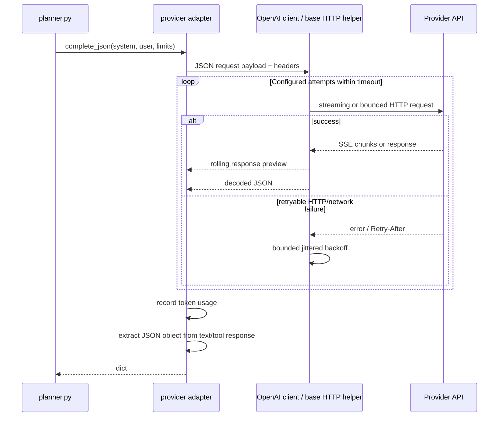

Provider error details are redacted for bearer tokens and common key formats.
OpenAI-compatible requests accumulate SSE deltas and replace the live status with
a whitespace-normalized preview of the latest response fragment. The preview is
bounded and transient, so it neither grows memory with a second response copy nor
clogs terminal history. The adapter can also reduce requested output tokens when
an endpoint reports a parseable context-window overflow. Both providers normalize
usage into the shared prompt/completion/total counters.

## Exact staging and commit lifecycle

The model never supplies a patch to execute. It selects hunk IDs; the local
stager reconstructs patches from the frozen snapshot and current worktree.

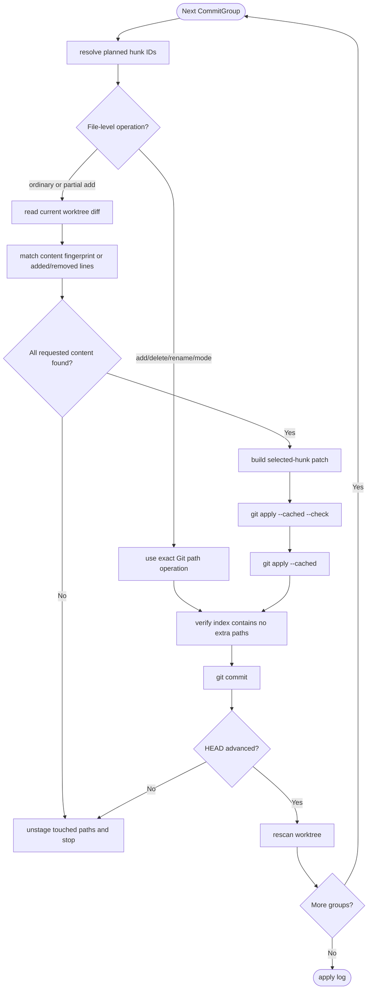

When `include_staged` is enabled, the committer first restores planned staged
paths to the worktree view and rescans. This lets every group pass through the
same exact staging logic instead of trusting the pre-existing index.

## Session, apply, and resume state

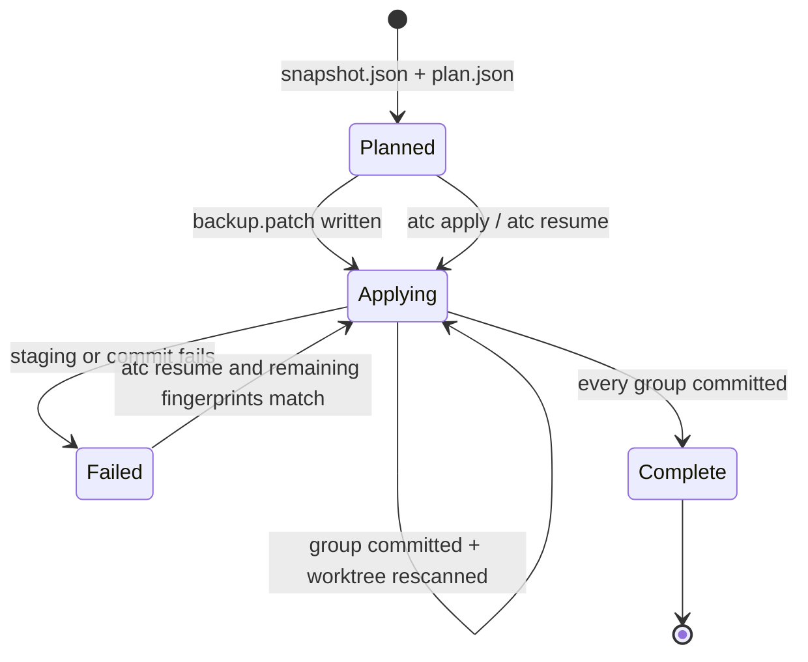

`latest_incomplete_session()` treats a plan with no log as resumable and a log
with `pending` or `failed` entries as incomplete. Resume does not compare the
whole original repository fingerprint because earlier groups may already have
advanced HEAD. Instead, it verifies that every fingerprint required by the
remaining groups is still present.

## Hook lifecycle

Only `atc commit` calls `prepare_hooks()` automatically.

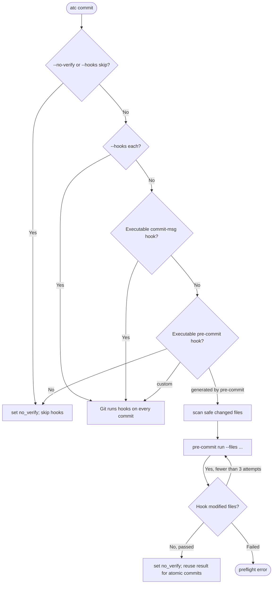

## Rewrite lifecycle

`--amend` and `--squash` are explicit history-rewriting paths:

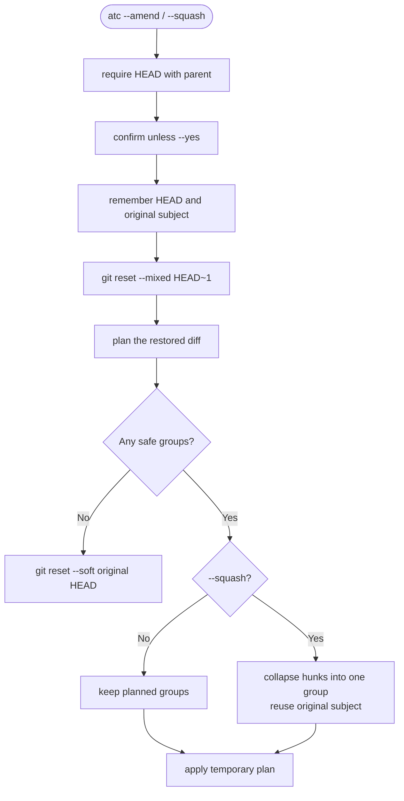

The committer date is nudged when necessary so recreating identical content
and metadata in the same second does not reproduce the old SHA.

## Failure boundaries and invariants

- Provider output is data, not executable instructions.
- Unsafe files never become safe merely because the provider references them.
- Plans cannot omit, duplicate, invent, or reorder dependent safe hunks.
- Saved plans cannot apply to a changed whole-worktree fingerprint.
- Resume can only apply remaining hunks whose content still matches.
- Staging cannot silently expand from selected hunks to a whole file.
- Apply stops at the first failed group and removes touched index entries.
- `atc` never pushes or performs a broad fallback commit.
