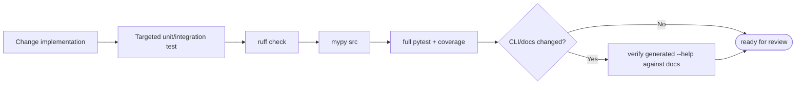

# Development and verification

## Local setup

```bash
python -m venv .venv
. .venv/bin/activate
python -m pip install -e '.[dev]'
```

The project uses Python 3.11+, Hatchling, Typer, Rich, Pydantic 2, and
`tomli_w`. Provider HTTP calls intentionally use the standard library instead
of vendor SDKs.

## Checks

Run the same core checks after changing code:

```bash
.venv/bin/ruff check src tests
.venv/bin/mypy src
.venv/bin/pytest
```

The configured test command includes coverage and fails below 60%. For a fast
targeted loop, override the project addopts:

```bash
.venv/bin/pytest -o addopts='-q' tests/unit/test_planner.py
```

Validate the installed command surface after CLI or documentation changes:

```bash
.venv/bin/atc --version
.venv/bin/atc --help
.venv/bin/atc commit --help
.venv/bin/atc selftest
```

`selftest` creates temporary synthetic repositories. Add `--live` only when a
configured provider should be called.

## Test layout

```text
tests/
├── unit/          parsers, fingerprints, safety, config, planning, providers
└── integration/   real temporary Git repositories and CLI/application flows
```

Unit tests should isolate deterministic policy. Integration tests should cover
behavior that depends on Git's index, rename detection, modes, untracked files,
staging, or session persistence.

## Change lifecycle



## Extension points

### Add a CLI option or command

1. Parse global options in `cli.main()` or command-specific options on the
   command function.
2. Carry shared runtime values in `RunConfig`.
3. Put reusable behavior in `flows.py` or the owning module, not in Typer code.
4. Preserve JSON mode: one machine-readable value on stdout and a non-zero
   exit for errors.
5. Update `atc --help`, the command table in `README.md`, and an integration
   test.

### Add a provider

1. Implement `AIProvider.complete_json()` in `providers/`.
2. Normalize response usage through the helpers in `providers/base.py`.
3. Use the shared HTTP/retry and secret-redaction behavior.
4. Add credential resolution in `config.py` and construction in
   `providers/__init__.py`.
5. Test JSON extraction, retry behavior, and provider-specific response shapes
   without network calls.

### Change planning

The planning contract is stricter than the prompt. Any change must preserve
the final `validate_plan()` invariants: exact safe-hunk coverage, unique groups,
valid dependency order, matching file paths, exclusions with reasons, and
acceptable commit messages. Exercise both direct and large-change paths and
verify cache invalidation when prompt semantics change.

### Change scanning or staging

Use real temporary Git repositories. Cover staged plus unstaged changes,
untracked files, partial-file hunks, rename/delete/mode-only changes, binary
policy, path filters, and repositories invoked through a subdirectory. The
central invariant is that a planned hunk is either staged exactly or rejected;
there is no whole-file fallback for a failed match.

## Documentation maintenance

The source, generated `--help`, and tests are authoritative. Keep docs focused
on current behavior:

- `README.md` owns user setup, commands, and operational safety.
- `docs/architecture.md` owns module relationships and code lifecycles.
- this file owns contributor setup and verification.
- `CHANGELOG.md` records released behavior, not future work or review notes.

When a command or lifecycle changes, update the relevant Mermaid diagram in the
same change.

